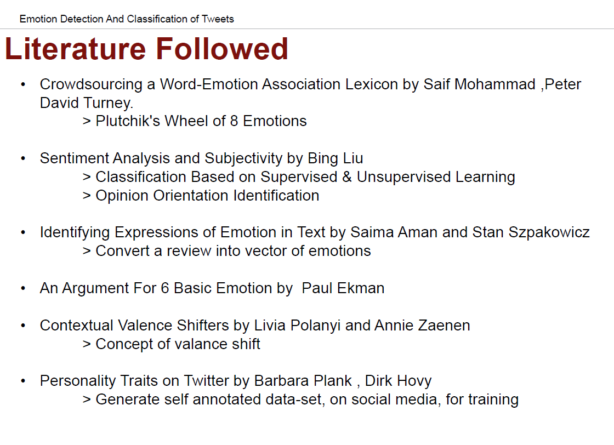

## Emotion Detection And Classification of Tweets

### How to Run
Below steps are tested on Ubuntu-14.04 node.

- Install dependencies:

	```
	# install utilities on up-to-date node
	apt-get update && apt-get -y dist-upgrade && apt-get -y install -f \
			&& apt-get -y install python python-pip python-dev build-essential \
			python-setuptools python-numpy python-scipy libatlas-dev libatlas3gf-base \
			python-sklearn

	# upgrade python2 requests package
	pip install --upgrade requests

	# pip packages
	pip install TwitterAPI \
                microsofttranslator \
                nltk

	# Download NLTK Data
	python -m nltk.downloader all
	```

- Edit following files:
	```
	app/assets/BingCredentials/bingClientId.txt
	app/assets/BingCredentials/bingClientSecret.txt
	app/assets/TwitterAPI/credentials.txt
	```

- Copy ```app/assets/TwitterAPI/credentials.txt``` to ```/usr/local/lib/python2.7/dist-packages/TwitterAPI/credentials.txt```

- Go inside ```app/``` directory.

- Run the following script
	```
	. ./run-services.sh
	```


### Project Structure
- Training dataset files: ```app/assets/Resource/searchKeys```
- Get Feeds by text search query: ```app/assets/Resource/searchKeys/testFiles```
- Bag of Words for emotion tagging and classification: ```app/assets/Resource```
- Output twitter data directory: ```app/assets/twitterData```


### Project Overview

The term paper of this work is present [here](Documents/term_paper.pdf). Below are the highlights of the work done + the results generated for live tweets on 28 December 2015.


***

***

***

***


### References
- [Bing Package](https://github.com/openlabs/Microsoft-Translator-Python-API)
- [TwitterAPI Package](https://github.com/geduldig/TwitterAPI) and [TwitterAPI end point requests](https://github.com/geduldig/TwitterAPI/blob/master/TwitterAPI/constants.py)
- [Google Geo Package](https://pypi.python.org/pypi/geocoder)
- [Scikit-learn Package](https://github.com/scikit-learn/scikit-learn)
- [Twitter Application Management](https://apps.twitter.com/)
- [Stream API Request Parameters](https://dev.twitter.com/streaming/overview/request-parameters)
